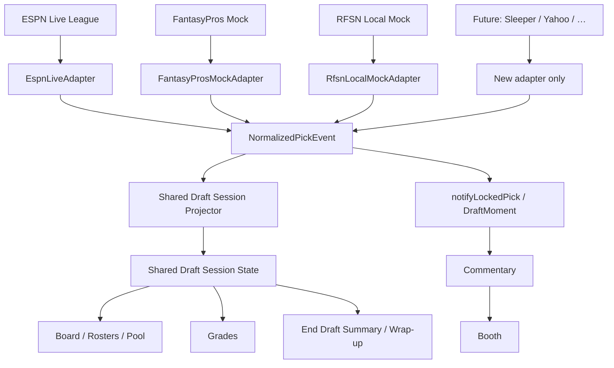

# Draft Source Adapter Architecture

**Status:** Implemented — ingestion + shared session projection  
**Scope:** How picks enter the system and project onto one shared draft experience. Grading algorithms, commentary quality, and booth orchestration are unchanged.

## Product model (permanent)

| Experience | Definition | Sources today | Future |
|---|---|---|---|
| **Live Draft** | Real in-season league draft | ESPN League | Sleeper League, Yahoo League |
| **Mock Draft** | Anything that is not a real league draft | RFSN Local Mock, FantasyPros Mock | ESPN Mock, Sleeper Mock, Yahoo Mock |

Every draft has identical capabilities (board, pool, rosters, clock, locked picks, announcers, commentary, grades, wrap-up). **Only the pick origin changes.**

## Pipeline



## Contracts

### `DraftSourceAdapter`

```ts
interface DraftSourceAdapter<TObservation> {
  readonly provider: DraftProviderId;
  readonly draftType: "live" | "mock";
  observe(observation: TObservation): NormalizedPickBatch | null;
}
```

Adapters **only observe**. They must not call grading, commentary, or booth APIs.

### `NormalizedPickEvent`

Provider-agnostic locked pick (`provider`, `draftType`, `draftId`, `leagueId`, round/pick/overall, team/owner/player fields, `timestamp`, optional `metadata`).

`toLockedPickInput` / `toNotifyLockedPickRequest` strip adapter metadata before `rfsnBroadcast.notifyLockedPick` so the server contract stays pick-only.

### Shared Draft Session Projector

`applyNormalizedPickEvent` / `applyNormalizedPickBatch` own board projection:

- append locked pick (idempotent)
- assign via schedule → roster
- remove from available pool (via drafted keys)
- refresh grades through `computeDraftGradesFromRosters`
- detect completion for `LiveDraftWrapUp`
- reset on source/session identity change

Local mock AI/user locks also go through the same projector — the simulator is not the exclusive board owner.

## Module map

| Path | Role |
|---|---|
| `shared/draftSource/types.ts` | Types, catalog, notify mappers |
| `shared/draftSource/espnLiveAdapter.ts` | ESPN Live → events (+ projectionBatch) |
| `shared/draftSource/fantasyProsMockAdapter.ts` | FantasyPros Mock → events (+ projectionBatch) |
| `shared/draftSource/rfsnLocalMockAdapter.ts` | RFSN Local Mock → events |
| `shared/draftSource/draftSessionProjector.ts` | Shared session state + projection |
| `client/src/hooks/useEspnLiveDraftMonitor.ts` | Poll → adapter → project + notify |
| `client/src/hooks/useFantasyProsMockDraftMonitor.ts` | Bridge → adapter → project + notify |
| `client/src/hooks/useRfsnLiveLockedPickNotify.ts` | Results diff → adapter → notify |
| `client/src/pages/DraftWarRoom.tsx` (`LiveDraftEngine`) | Owns shared session; drives UI |

**Unchanged:** `liveDraftMomentSession`, DraftMoment builder, live broadcast / booth, grading letter algorithm.

## Adding a provider

1. Add a `DraftProviderId` + catalog row (`available: true` when ready).
2. Implement one adapter that emits `NormalizedPickEvent` (and a projection batch for reconnect baselines).
3. Mount a thin hook/listener that calls `observe` → shared projector + `toNotifyLockedPickRequest` → `notifyLockedPick`.

No new grading, commentary, board, or booth forks.
